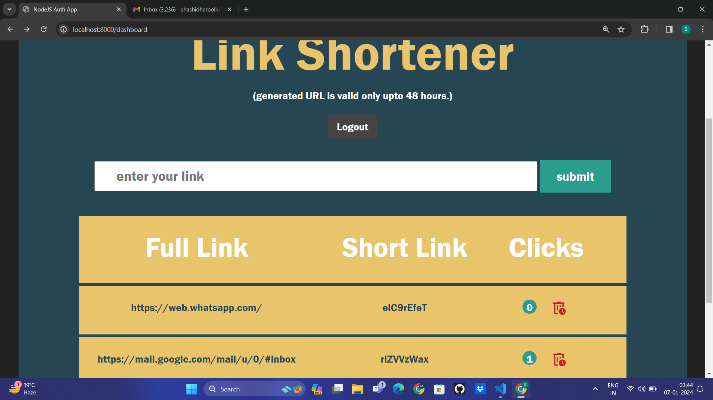
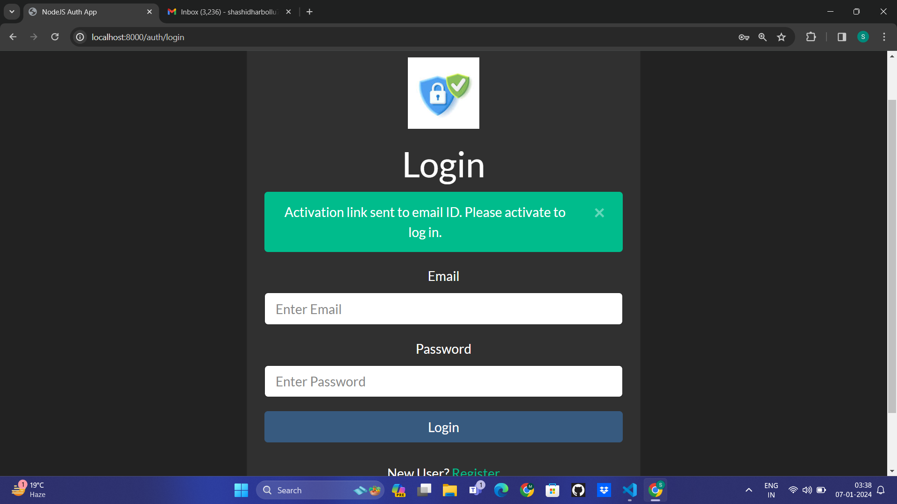
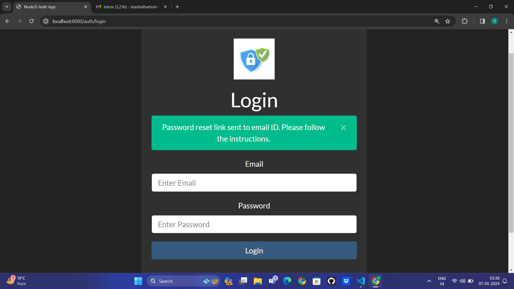
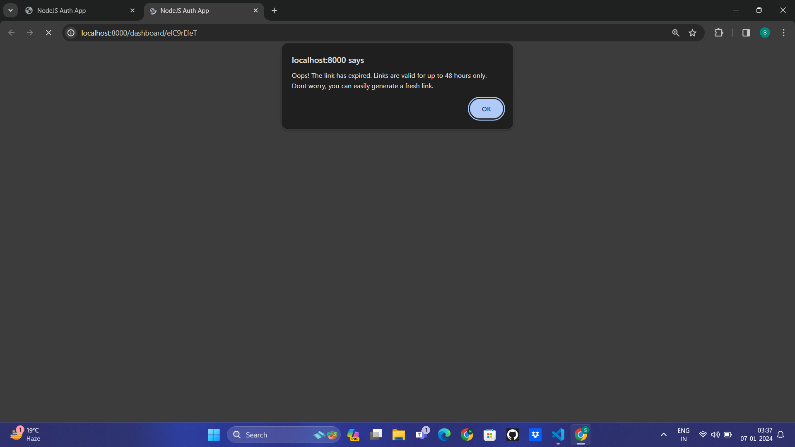

# NodeJS Authentication and URL Shortener Project with active links with expire time

## Project Overview

This NodeJS Authentication and URL Shortener project provide a secure and user-friendly environment for shortening URLs. Users can register, log in, log out, and reset their passwords. Activation links are sent to newly registered users via email for account activation. And the geerated links are valid only unto 48 hours

## Getting Started

1. Clone the project using the following command:
    ```
    git clone <repository_url>
    ```

2. Install dependencies by running:
    ```
    npm install
    ```

3. Set up MongoDB:
    - Create a local MongoDB instance.
    - Update the MongoDB URL in `index.js`.

4. Start the application:
    ```
    npm start
    ```

## Project Structure

The project follows a structured folder organization:

- **assets**: Contains images and CSS files.
- **config**: Configuration files including authentication middleware and key management.
- **controllers**: Handles application logic, including authentication.
- **models**: Defines Mongoose models for users and URLs.
- **routes**: Defines routes for authentication and URL shortening.
- **views**: Contains EJS templates for rendering pages.

## Screenshots


*Welcome page for the URL shortener app.*


*User registration page with activation link sent by email.*


*Secure login page for registered users.*


*Password reset functionality with email verification.*


*Secure login page for registered users.*

.png)
*Password reset page with a secure token.*

*Password reset page with a secure token.*
## Dependencies

- **Express**: Web application framework for Node.js.
- **Passport**: Authentication middleware for Node.js.
- **Mongoose**: MongoDB object modeling for Node.js.
- **Nodemailer**: Send email from Node.js applications.

## Contributing

Contributions are welcome! Feel free to fork the repository, create a new branch, and submit a pull request.

## License

This project is licensed under the [MIT License](LICENSE).

## Acknowledgments

Special thanks to [OpenAI](https://openai.com/) for providing the GPT-3.5 architecture that assisted in creating this README file.

*Note: Ensure you have MongoDB installed and running before starting the application. Make sure to replace `<repository_url>` with the actual repository URL when cloning the project.*
